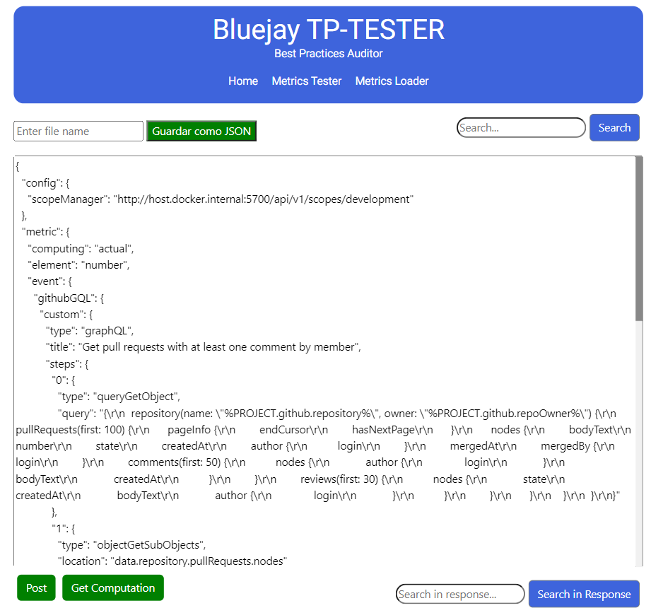
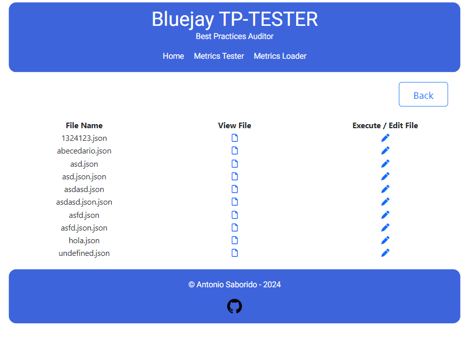
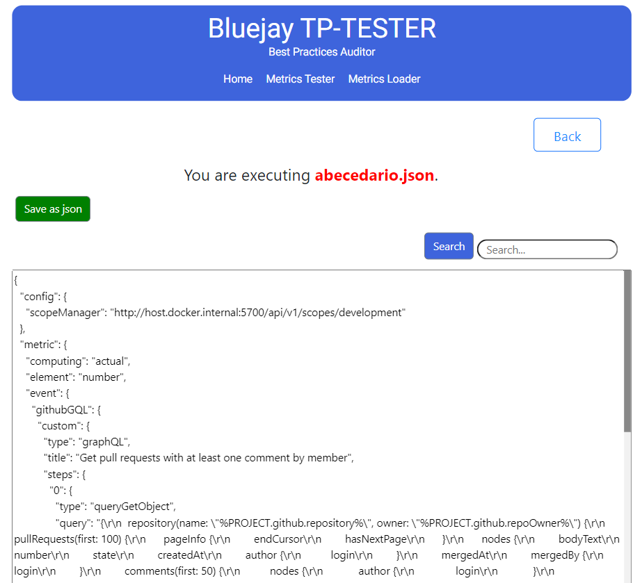

# Bluejay TP-TESTER

This project was generated with [Angular CLI](https://github.com/angular/angular-cli) version 13.3.11.

This project also has a back-end side which allows you to save / modify / delete some files. Those files are stored locally on your computer.

## Development server

To run this project locally in development mode, you have to:

1. Run `ng serve` for a dev server. Navigate to `http://localhost:4200/`. The application will automatically reload if you change any of the source files.

2. Run `node server.js` to start the back-end server. The server will be running on `http://localhost:4002/`.

## Functionalities
The project comprises two main pages with functionalities, which are:
### Metrics Tester

 This page brings default metrics and allows you to execute them, displaying the values that the metric provides for the selected period. Additionally, it enables you to save the metric locally.
 
### Metrics Loader

Upon entering this page, all the saved metrics will appear. Here, you'll find two buttons: "Visualize" and "Edit/Execute." If you choose to visualize a metric, its code will be displayed. However, if you opt to edit/execute it, you'll enter a page similar to Metrics Tester but for the selected file.

These functionalities enhance the usability of the application, allowing users to both test predefined metrics and manage saved ones efficiently.

