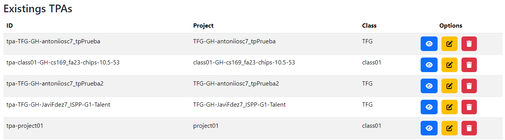
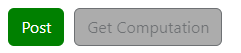
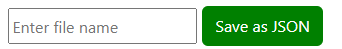
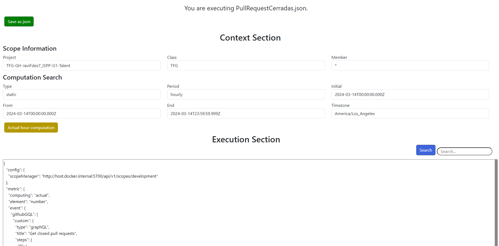
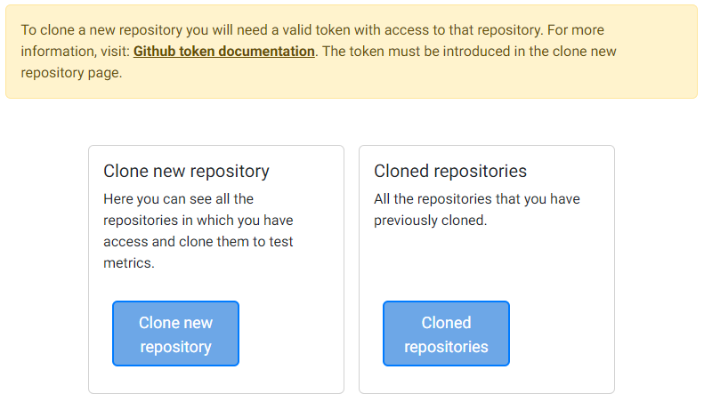
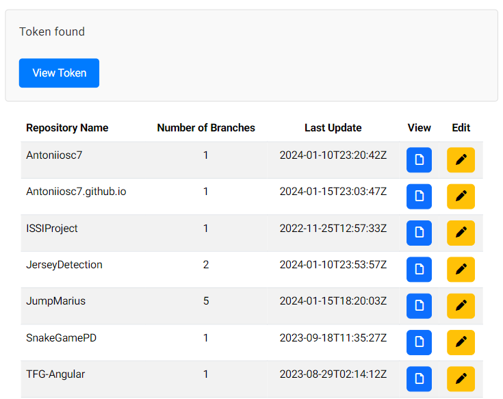
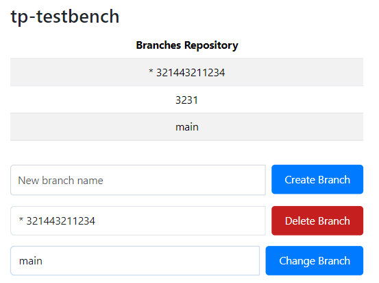
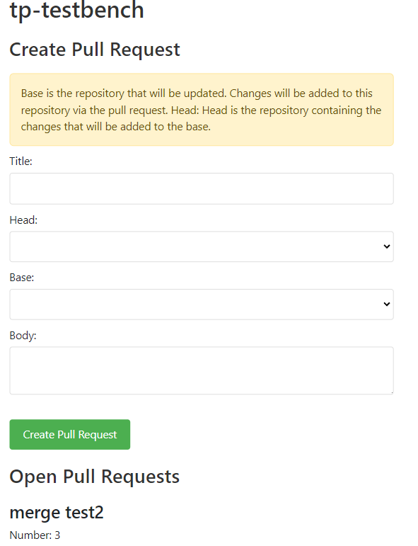
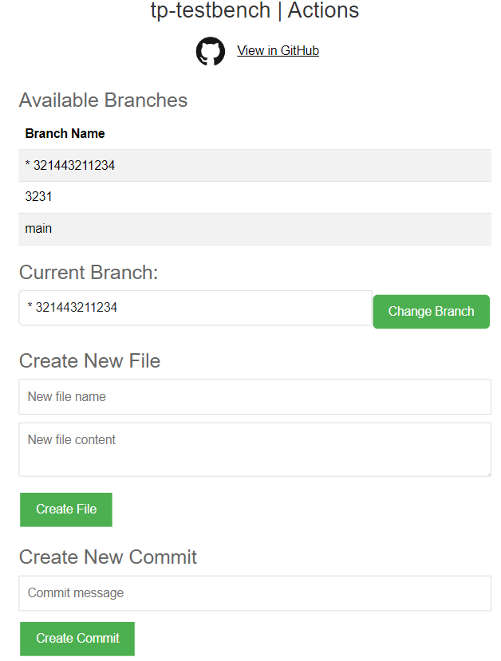
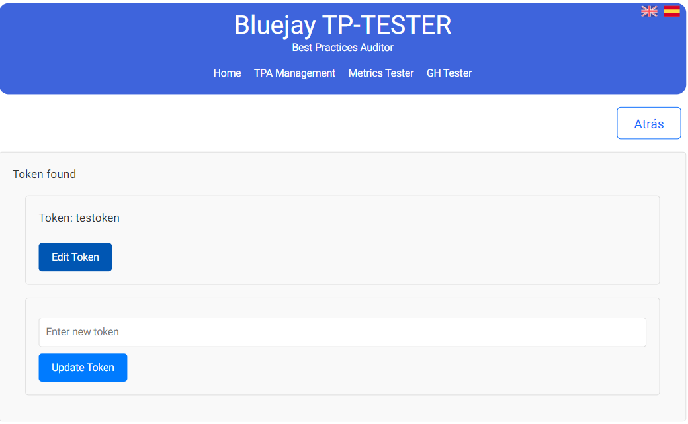

# Bluejay - TP  Tester
Este proyecto es una extensión de Bluejay. La documentación oficial de Bluejay se puede encontrar en: [docs.bluejay.governify.io](https://docs.bluejay.governify.io/). Al ser una extensión de Bluejay, es imprescindible para el completo funcionamiento de Bluejay-Tester.
# Índice
- [Bluejay - TP Tester](#bluejay---tp-tester)
  - [Introducción](#introducción)
    - [¿Qué es Bluejay?](#qué-es-bluejay)
    - [¿Para qué sirve Bluejay-TP Tester?](#para-qué-sirve-bluejay-tp-tester)
  - [Puesta en marcha](#puesta-en-marcha)
    - [Modo desarrollo](#modo-desarrollo)
    - [Con docker](#con-docker)
- [Testear TPAs](#testear-tpas)
- [Testear métricas](#testear-métricas)
  - [Edición de métricas](#edición-de-métricas)
- [Testeo de repositorios](#testeo-de-repositorios)
- [Interacción con la API de GitHub](#interacción-con-la-api-de-github)
  - [Crear un token de acceso personal](#crear-un-token-de-acceso-personal)
- [Interacción con la API de Bluejay](#interacción-con-la-api-de-bluejay)
- [GlassMatrix API](#glassmatrix-api)
  - [Funcionalidades de la API](#funcionalidades-de-la-api)
  - [Documentación de la API con Swagger](#documentación-de-la-api-con-swagger)
  - [Ejemplos de uso](#ejemplos-de-uso)
- [Traducciones](#traducciones)

## Introducción
### ¿Qué es Bluejay?
Bluejay Infrastructure es una infraestructura basada en Governify que permite auditar equipos ágiles de manera sencilla. Está compuesta por un subconjunto de microservicios de Governify que pueden ser desplegados ya sea en una sola máquina o en un clúster. Bluejay accede a múltiples fuentes para recopilar información sobre los equipos de desarrollo, como GitLab, Jira, Slack, etc., y utiliza esta información para verificar si esos equipos cumplen con un Acuerdo de Prácticas de Equipo (TPA) que incluye métricas y garantías relacionadas con la metodología ágil.

### ¿Para qué sirve Bluejay-TP Tester?
El objetivo de este TP-Tester es, como dice su nombre, poder probar en primer lugar las métricas que componen los TPs (Team Practices). Una vez comprobadas que estas métricas funcionan correctamente, TP-Tester te permite comprobar que todo el TPA (Team Practice Agreement) funcione correctamente. Para ello, se pueden añadir, eliminar, o modificar TPAs que se encuentran directmanente en Bluejay desde este TP Tester.
## Puesta en marcha
### Modo desarrollo
Para levantar Bluejay-TP Tester en modo desarrollo, sigue los siguientes pasos:
1. Clona el repositorio de Bluejay-TP Tester.
2. Instala las dependencias con `npm install`.
3. Levanta el proyecto con `ng start`.

Con esto bastaría ya que el proyecto utiliza concurrently y levanta a la vez el servidor express y angular. El servidor Express (GlassMatrix API) se levanta en el puerto 6012 y la aplicación Angular en el puerto 4200.

### Con docker
Para levantar Bluejay-TP Tester con docker, sigue los siguientes pasos:
1. Clona el repositorio de Bluejay-TP Tester.
2. Ejecuta `docker-compose up --build`.

Con esto ya tendríamos el proyecto levantado en el puerto 6011 la web angular, y el servidor express en el puerto 6012.

# Testear TPAs
Esta seccion permite visualizar los TPAs que ya se encuentran cargados dentro de Bluejay.



Si seleccionamos la opción de editar, se podrá editar todo el TPA o se podrá usar un editor que permite editar métrica a métrica o añadir una nueva métrica al TPA fácilando así la edicición del TPA. En esta tabla también podemos encontrar la opción de simplemente ver el TPA o borrarlo (Esto lo borraría de Bluejay directamente).

# Testear métricas
Para testear métricas, en primer lugar habrá que acceder a la página de metrics tester. En primer lugar hay una sección en donde podemos realizar acciones con las métricas ya guardadas. En la parte inferior, podemos testear una nueva métrica.

Por defecto, habrá una métrica en la zona de crear nueva metrica. Esta métrica es simplemente un ejemplo y es totalmente editable o directamente se puede borrar y usar una nueva.


Una vez que hemos introduccido la métrica que queremos testear, hay que darle a publicar. Esto interactuará con el endpoint de Bluejay y tras obtener la computación inicial, se desbloqueará el botón de obtener cálculo. Esto tardará unos segundos y devolverá los valores de las métricas que estamos testando en ese repositorio.



Una vez que hemos comprobado la métrica (o antes si lo deseas) también habrá un botón para guardar la métrica y tenerla siempre a mano en el repostiorio local con el nombre que queramos. Cuando la tengamos guardada, ya se podrá acceder a ella desde la seccion superior y podremos volver ejecutarla, editarla o borrarla.



## Edición de métricas
Si en la primera seccion accedemos a editar métrícas entraremos en una página como la inferior. Esta página tiene la opción de utilizar la hora actual (utilizará como fecha de inicio el comienzo de la hora actual, si son las 18:27, la hora de inicio será las 18:00 y la hora de final de computación serán las 18:59 del día en el que se realice). Si se guarda la métrica desde esta sección, se guardará con el periódo de calculo utilizado.



Tras esta sección de edición volverá a estar disponible la opción de probar la métrica interactuando con Bluejay

# Testeo de repositorios
Al entrar en la pantalla, vamos a poder elegir entre dos subpantallas.



La primera de ella será la página para clonar un nuevo repositorio. En ella, al inicio hay una sección para añadir o editar el token de github y tras introducir un token válido aparecen todos los repositorios a los que tiene acceso con ese token. Además cada repositorio que aparezca listado tendrá dos opciones, verlo en github para asegurarnos de que es el repositorio que queremos clonar y otra pantalla opción es la de editar que permite clonar el repositorio en local.



Por otro lado, si en la pantalla principal de Repository Tester accedemos a repositorios clonados, listará todos los repositorios que hayamos clonado ya, y para cada uno de ellos tendremos 3 opciones, una para crear / eliminar o cambiar de rama. Otra opción para realizar pull requests y otra opción que permitirá crear archivos y realizar commits y pushes.

A continuación se pueden ver como son las vistas de las 3 opciones:





# Interacción con la API de GitHub
Para que esta API funcione correctamente, es necesario introducir el token de GitHub mediante la GlassMatrix API. Solo podrás ver los repositorios a los que tu usuario tenga acceso con ese token.

Este proyecto utiliza la API de GitHub para interactuar con repositorios de GitHub. Esto se hace a través de un servicio Angular llamado GithubService. Aquí hay una descripción de cómo se utilizan algunas de las funciones en este servicio:

- **createTpa:** Crea un nuevo acuerdo con el contenido proporcionado.
- **getTps:** Obtiene una lista de todos los acuerdos.
- **getTpa:** Obtiene un acuerdo específico por su ID.
- **deleteTpa:** Elimina un acuerdo específico por su ID.
- **postComputation:** Realiza una petición POST a la API de cálculos con los datos proporcionados.
- **getComputation:** Obtiene los resultados de un cálculo específico a través de su URL.

## Crear un token de acceso personal
1. En la esquina superior derecha de cualquier página, haz clic en la foto de tu perfil, luego haz clic en Configuración.
   
2. En la barra lateral izquierda, haz clic en Configuración del desarrollador.
3. En la barra lateral izquierda, haz clic en Tokens de acceso personal.
4. Haz clic en Generar nuevo token.
5. En el campo "Nota", dale a tu token un nombre descriptivo.
6. Para darle una caducidad a tu token, selecciona Expiración, luego elige una opción predeterminada o haz clic en Personalizado para ingresar una fecha.
7. Selecciona los ámbitos que te gustaría otorgar a este token. Para usar tu token para acceder a repositorios desde la línea de comandos, selecciona repo. Un token sin ámbitos asignados solo puede acceder a información pública. Para más información, consulta "Ámbitos para aplicaciones OAuth".
8. Haz clic en Generar token.
9. Opcionalmente, para copiar el nuevo token a tu portapapeles, haz clic en el icono de dos cuadrados superpuestos.
   

Para más información, visita [la documentación oficial de GitHub](https://docs.github.com/en/enterprise-server@3.9/authentication/keeping-your-account-and-data-secure/managing-your-personal-access-tokens).

# Interacción con la API de Bluejay
Este proyecto utiliza la API de Bluejay para interactuar con acuerdos. Esto se hace a través de un servicio Angular llamado BluejayService. Aquí hay una descripción de cómo se utilizan algunas de las funciones en este servicio:

Para el funcionamiento de todos estas llamadas y de las páginas TPA-Management y Metrics Tester es necesario que esté levantado toda la estructura de Bluejay. Para más información sobre esto, visita [la documentación oficial de Bluejay](http://docs.bluejay.governify.io).

- **createTpa:** Crea un nuevo acuerdo con el contenido proporcionado.
- **getTps:** Obtiene una lista de todos los acuerdos.
- **getTpa:** Obtiene un acuerdo específico por su ID.
- **deleteTpa:** Elimina un acuerdo específico por su ID.
- **postComputation:** Realiza una petición POST a la API de cálculos con los datos proporcionados.
- **getComputation:** Obtiene los resultados de un cálculo específico a través de su URL.

# GlassMatrix API

Este proyecto tiene su propia API. Esta api se usa tanto para interactuar con la infraestrctura de Bluejay, que permite crear TPAs, probar métricas como para realizar acciones de github en local como clonar repositorios, crear ramas, moverte de ramas, hacer commits o pushes.

## Funcionalidades de la API

- **Interacción con Bluejay:** Permite crear TPAs y probar métricas.
- **Acciones de GitHub en local:** Permite clonar repositorios, crear ramas, cambiar de ramas, hacer commits y pushes.
- **Guardado Token Github:** Para que tanto las acciones de github en local, como las llamadas a la propia API de github funcione correctamente, es necesario tener un token válido de github. Por tanto, Glassmatrix API tiene un método por almacenar este token en el repositorio local (está en un .gitignore) y además permite añadirlo, modificarlo y borrarlo gráficamente. Esta opcion se encuentra disponible en GH Tester -> Clonar nuevo repositorio.



## Documentación de la API con Swagger

Esta API implementa Swagger para tener siempre de una forma todos los endpoints de la API junto con una pequeña documentación del funcionamiento de cada Endpoint. Gracias a Swagger se pueden visualizar todos los endpoints y probarlos en su interfaz gráfica que está disponible en: [http://localhost:6012/api-docs/](http://localhost:6012/api-docs/)

## Ejemplos de uso

A continuación, se presentan algunos ejemplos de como se ve API a través de swagger en donde se pueden ejecutar directamente las llamadas:


# Traducciones

Gracias a la libreria ngx-translate ([github.com/ngx-translate/core](https://github.com/ngx-translate/core)). Por defecto, TP Tester, estará en el idioma del navegador. Esta libreria permite además añadir traducciones de una forma sencilla ya que bastaría con traducir el Json de un idioma a otro y no habría que modificar ningún otro tipo de fichero.

Este es un fragmento de cómo funciona el .json de lenguaje:

```json
"METRICS_LOADER": {
  "TITULO1": "Métricas guardadas",
  "TITULO2": "Crear nueva métrica",
  "MESSAGE_TEXT": "No hay métricas guardadas",
  "FILE_NAME": "Nombre del archivo",
  "VIEW_FILE": "Ver archivo",
  "EXECUTE_EDIT_FILE": "Ejecutar / Editar archivo",
  "DELETE_FILE": "Eliminar archivo",
  "VIEWER": {
    "VIEWING": "fileName."
  }
}
