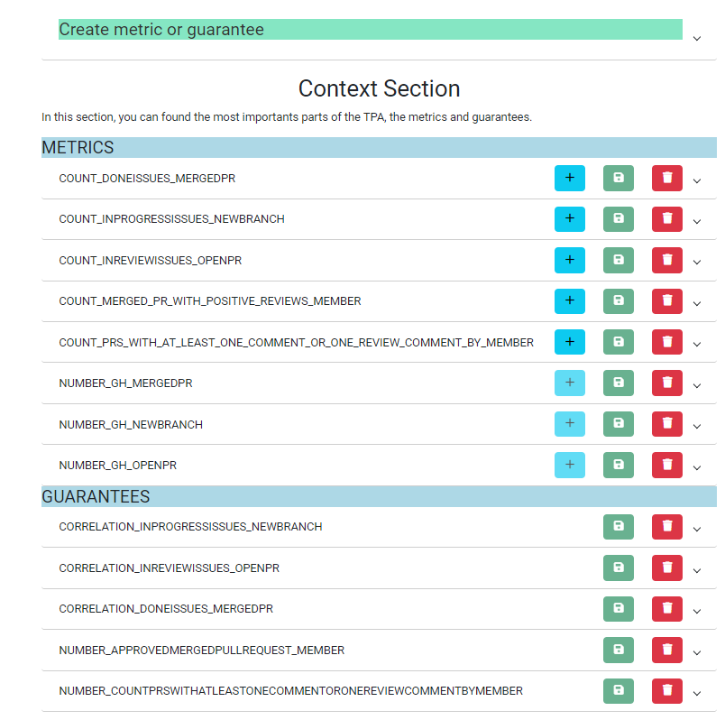
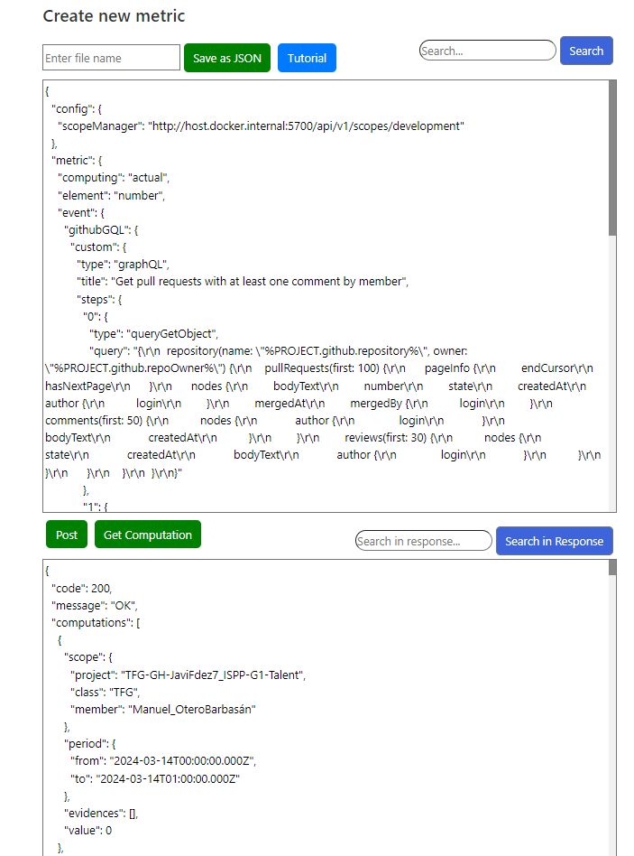
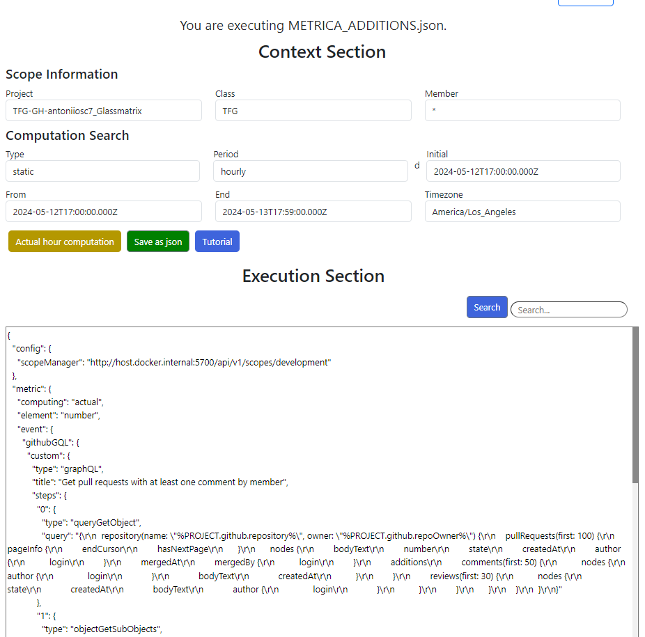
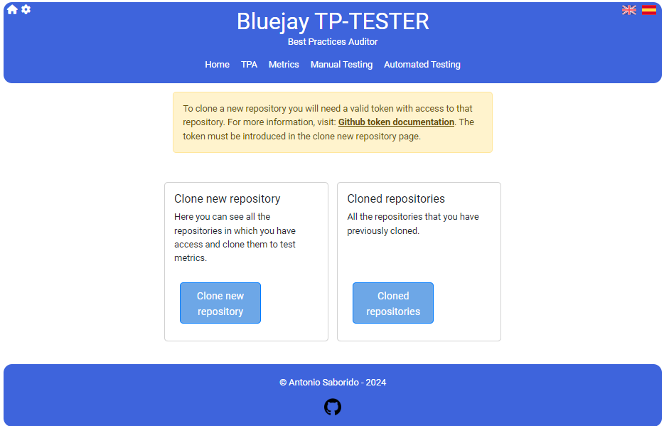
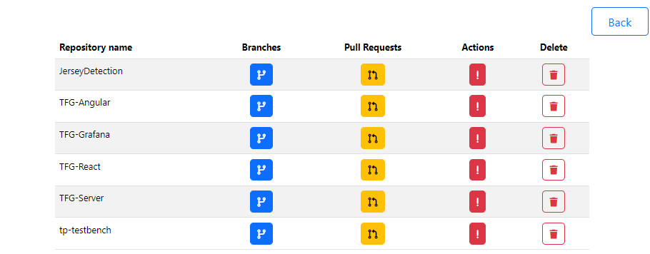
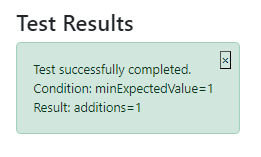
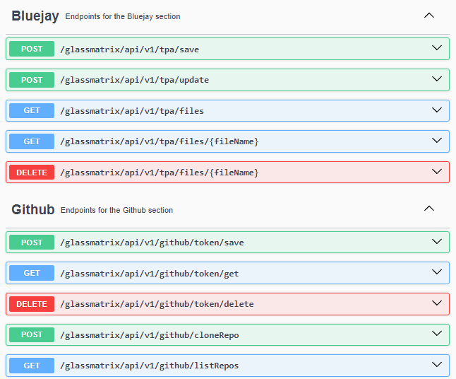

# Bluejay - TP Tester
This project is an extension of Bluejay. The official documentation for Bluejay can be found at: [docs.bluejay.governify.io](https://docs.bluejay.governify.io/). Being an extension of Bluejay, it is essential for the full operation of Bluejay-Tester.

# Index
- [Bluejay - TP Tester](#bluejay---tp-tester)
  - [Introduction](#introduction)
    - [What is Bluejay?](#what-is-bluejay)
    - [What is the purpose of Bluejay-TP Tester?](#what-is-the-purpose-of-bluejay-tp-tester)
  - [Getting started](#getting-started)
    - [Development mode](#development-mode)
    - [With docker](#with-docker)
- [TPA Management](#tpa-management)
  - [TPA Page](#tpa-page)
  - [TPA Edit](#tpa-edit)
- [Metrics](#metrics)
  - [Metrics Loader](#metrics-loader)
  - [Metrics Viewer](#metrics-viewer)
  - [Metrics Executor](#metrics-executor)
- [Manual Testing Page](#manual-testing-page)
  - [Clone New Repository](#clone-new-repository)
  - [Cloned Repository](#cloned-repository)
- [Automated Testing](#automated-testing)
  - [Page Structure](#page-structure)
  - [YAML File Loading](#yaml-file-loading)
  - [Test Execution](#test-execution)
  - [Results Visualization](#results-visualization)
  - [Test Results](#test-results)
  - [Variables to Use](#variables-to-use)
- [Configuration Page](#configuration-page)
  - [Get Github Token](#get-github-token)
  - [Swagger API Documentation](#swagger-api-documentation)
  - [Translations](#translations)

## Introduction
### What is Bluejay?
Bluejay Infrastructure is a Governify-based infrastructure that allows for easy auditing of agile teams. It is composed of a subset of Governify microservices that can be deployed either on a single machine or on a cluster. Bluejay accesses multiple sources to gather information about development teams, such as GitLab, Jira, Slack, etc., and uses this information to verify whether these teams comply with a Team Practice Agreement (TPA) that includes metrics and guarantees related to agile methodology.

### What is the purpose of Bluejay-TP Tester?
The purpose of this TP-Tester is, as its name suggests, to first test the metrics that make up the TPs (Team Practices). Once these metrics have been verified to work correctly, TP-Tester allows you to check that the entire TPA (Team Practice Agreement) works correctly. To do this, you can add, delete, or modify TPAs that are directly in Bluejay from this TP Tester.
## Getting started
### Development mode
To lift Bluejay-TP Tester in development mode, follow these steps:
1. Clone the Bluejay-TP Tester repository.
2. Install the dependencies with `npm install`.
3. Lift the project with `npm start`.

This would be enough since the project uses concurrently and lifts both the express server and angular at the same time. The Express server (GlassMatrix API) is lifted on port 6012 and the Angular application on port 4200.

### With docker
To lift Bluejay-TP Tester with docker, follow these steps:
1. Clone the Bluejay-TP Tester repository.
2. Install the dependencies with `npm install`.
3. Run `npm run docker`.

With this, we would have the project lifted on port 6011 the angular web, and the express server on port 6012.# TPA Management
# TPA PAGE
The TPA management page allows you to visualize and interact with those TPAs that are within Bluejay. 

### Existing TPAs

This section displays a table of all existing TPAs. Each row in the table represents a single TPA, displaying its ID, project, and class.

There are also several action buttons for each TPA:

- The **Copy** button allows you to copy the content of a TPA intro the lower textarea.
- The **View** button navigates to a detailed view of the TPA.
- The **Edit** button navigates to a page where you can edit the TPA.
- The **Delete** button navigates the TPA from the Bluejay DB.

### Create TPA

This section allows you to create a new TPA. It provides a text area where you can input the content of the new TPA.

There are two buttons:

- The **Create TPA** button creates a new TPA with the content you've inputted in the text area.
- The **Copy Default TPA** button fills the text area with the content of a default TPA, which you can then modify and create as a new TPA.

## TPA Edit

When you click on the edit button of a TPA, you will enter a subpage that will give you access to two other subpages. 

- One where you can edit the entire TPA.
- And another where you can edit the TPA by sections.
### EDIT ENTIRE TPA
Here you will be able to edit the TPA Content in a textarea with the current content of the TPA and a save button that will update that content

### EDIT TPA BY SECTIONS
In this page you can edit the TPA by sections, editing or deleting each metric and guarantee of the TPA. And you can also add new metrics and guarantees. If you select the "more" button, it will generate an individual metric for you to review and test, and it will redirect you to the new page with that created metric.



# Metrics

The Metrics Loader page is designed to manage and test metrics. It provides a user-friendly interface for viewing, creating, and managing metrics.

### Existing metrics
Here you can see all the saved metrics, classified into two large tables. One table consists of those saved from the TPA section, which will be related to the TPA they belonged to. The other table contains saved individual metrics, which are not related to any specific TPA.

Each row in the table represents a single metric, displaying its name and providing action buttons:
- The **View** button navigates to a detailed view of the metric.
- The **Execute/Edit** button navigates to a page where you can execute or edit the metric.
- The **Delete** button deletes the metric.

### Create new metric
This section allows you to create a new metric. It provides a text area where you can input the content of the new metric.

There are two buttons:
- The **Post** button posts the content you've inputted in the text area to the Bluejay API for computation.
- The **Get Computation** button retrieves the computation results from the Bluejay API.



In this section, you can also view a tutorial that will guide you through the process of creating a new metric. Also, you can save your metric as a JSON file.

## Metrics Viewer
The Metrics Viewer page allows you to view the details of a specific metric. It displays the current JSON representation of the metric.  

## Metrics Executor
The Metrics Executor page allows you to execute a specific metric. It provides a user-friendly interface for viewing and modifying the metric's details, and for executing the metric.


### Metric Details
This section displays the details of the metric. It provides several input fields where you can modify the metric's details:

- The **Projects** field allows you to specify the project associated with the metric.
- The **Class** field allows you to specify the class associated with the metric.
- The **Period** field allows you to specify the period for the metric.

### Computation Search

This section allows you to specify the parameters for the computation of the metric. It provides several input fields:

- The **Type** field allows you to specify the type of computation.
- The **Period** field allows you to specify the period for the computation.
- The **Initial** field allows you to specify the initial date for the computation.
- The **From** field allows you to specify the starting date for the computation.
- The **End** field allows you to specify the ending date for the computation.
- The **Timezone** field allows you to specify the timezone for the computation.

There are also several buttons:  
- The **Set to Current Hour** button sets the computation parameters to the current hour.
- The **Save as JSON** button saves the metric and its details as a JSON file.
- The **Tutorial** button opens a tutorial dialog.

### Execution Section
This section allows you to execute the metric. It provides a text area where you can view the JSON representation of the metric.  
There are also several buttons:  
- The **Post** button posts the metric to the Bluejay API for computation.
- The **Get Computation** button retrieves the computation results from the Bluejay API.


# Manual Testing Page

The Manual Testing page provides a user-friendly interface for testing the functionality of the application. It provides two main options: creating a new repository or working with a cloned repository.


## Clone New Repository

Here you can see all the repositories that the entered token has access to.

Each repository will also have two buttons: the "View" button, which will redirect you to the GitHub page of the repository, and the "Edit" button, which will take you to the clone page.

### Clone Page

The Clone page allows you to clone a specific repository. It displays the details of the repository, including its name, description, owner, creation time, update time, language, visibility, and a list of all branches. It also provides a button to clone the repository.

## Cloned Repository

This section allows you to work with a cloned repository. It provides a brief description of the process and a button to start working with the cloned repository.



### Branches Page

The page allows you to manage the branches of a repository. It provides options to view the branches, create a new branch, delete a branch, and change the current branch.

### Pull Requests Page

The Pull Requests page provides a user-friendly interface for managing the pull requests of a repository. It provides options to create a new pull request, view the open pull requests, and merge a pull request.

### Actions Page

The Actions page interface for managing a repository. It provides options to view the available branches, change the current branch, create a new file, create a new commit, push changes, view files in the repository, and manage issues.


# Automated Testing
- [YAML File Loading](#yaml-file-loading)
- [Test Execution](#test-execution)
  - [GET Methods](#get-methods)
  - [POST Methods](#post-methods)
  - [PUT Methods](#put-methods)
  - [DELETE Methods](#delete-methods)
  - [TEST Methods](#test-methods)
- [Results Visualization](#results-visualization)
- [Test Results](#test-results)
- [Variables to Use](#variables-to-use)
  - [actualTime](#actualtime)
  - [value](#value)
  - [minExpectedValue](#minexpectedvalue)
  - [maxExpectedValue](#maxexpectedvalue)
  - [expectedValue](#expectedvalue)

## Page Structure
This page is a user interface for running and testing scripts. These scripts will have a .yaml format, and will interact with the GitHub API and Repositories to test already created metrics. The page is divided into several sections:

## YAML File Loading
At the top of the page, there is a table that displays all available YAML files. Users can copy the file content, view the file, edit the file, or delete the file.

## Test Execution
In the execution section, users can enter the name of the YAML file they want to execute. They can also save the current content of the text box (it must follow the example format and the calls will be executed sequentially),

Users will be able to follow a series of "steps". The "steps" are actions that can be performed in the system. These steps are predefined and perform HTTP methods (like 'GET', 'POST', 'PUT', 'DELETE') to the corresponding actions. Here are the possible steps:

1. GET Methods
  - `github/getIssue`: This step gets the issues from a specific repository on GitHub.
  - `github/getOpenPR`: This step gets the open pull requests from a specific repository on GitHub.
  - `github/pullCurrentBranch`: This step performs a pull of the current branch in a specific repository.
  - `github/listRepos`: This step lists all repositories.
  - `github/getBranches`: This step gets all the branches from a specific repository.
  - `github/getRepoInfo`: This step gets information about a specific repository and a specific branch.

2. POST Methods
  - `github/mergeLastOpenPR`: This step merges the last open pull request in a specific repository on GitHub.
  - `bluejay/compute/tpa`: This step loads the data from a file and then performs a computation on the data.
  - `bluejay/compute/metric`: This step loads the data from a file and then performs a computation on the data.
  - `bluejay/checkContain`: This step (which is marked as deprecated) checks if a specific value is present in the data obtained from an API.
  - `github/createIssue`: This step creates a new issue in a specific repository on GitHub.
  - `github/createPR`: This step creates a new pull request in a specific repository on GitHub.
  - `github/cloneRepo`: This step clones a specific repository.
  - `github/createBranch`: This step creates a new branch in a specific repository.
  - `github/createFile`: This step creates a new file in a specific repository.
  - `github/createCommit`: This step creates a new commit in a specific repository.
  - `github/commitAllChanges`: This step commits all changes in a specific repository.
  - `github/pushChanges`: This step pushes all changes in a specific repository.

3. PUT Methods
  - `github/mergePR`: This step merges a specific pull request in a specific repository on GitHub.
  - `github/changeBranch`: This step changes to a specific branch in a specific repository.

4. DELETE Methods
  - `github/deleteRepo`: This step deletes a specific repository.
  - `github/deleteBranch`: This step deletes a specific branch from a repository.
  - `github/deleteFile`: This step deletes a specific file from a repository.

5. TEST Methods
  - `bluejay/check`: This step performs a series of checks on the data obtained from an API. It checks if the value of a specific key meets certain conditions (like a minimum expected value, a maximum expected value, or an exact expected value).
  - `bluejay/findCheck`: This step is similar to `bluejay/check` but it has a different format which allows you to check more fields at once.
    Each step is executed based on the data provided in the text box that is being processed.

## Results Visualization
After running the test block, the results are displayed in a read-only text area. If the script performed a computation, the results of that computation are also displayed in a read-only text area.

## Test Results
In the right column of the page, users can see the results of the tests that have been run. Each test result is displayed on its own card, and users can delete individual test results.



## Variables to Use
### actualTime
To compute the metric with the current time, you should add actualTime: "true" to the "bluejay/compute/metric" method. If, on the other hand, you want it to use the original time of the metric, you can delete "actualTime" or set it to "false".

```yaml
steps:
  - uses: "bluejay/compute/metric"
    with:
      collector: "EVENTS"
      metric: "additions_metric.json"
      actualTime: "true"
    method: "POST"
  - uses: "bluejay/check"
    with:
      - key: "additions"
        conditions:
          expectedValue: "49"
    method: "TEST"
```

### value
If there are multiple results, you can use the "value" metric to only check those evidences that have the "value" field in the set value.

```yaml
steps:
  - uses: "bluejay/compute/metric"
    with:
      collector: "EVENTS"
      metric: "additions_metric.json"
    method: "POST"
  - uses: "bluejay/check"
    value: "1"
    with:
      - key: "additions"
        conditions:
          minExpectedValue: "5"
```

### minExpectedValue
The test will be successful if there is any field called like the key field, in this case "additions" whose value is numeric and is greater than 5.

```yaml
  - uses: "bluejay/check"
    value: "1"
    with:
      - key: "additions"
        conditions:
          minExpectedValue: "5"
```

### maxExpectedValue
The test will be successful if there is any field called like the key field, in this case "additions" whose value is numeric and is less than 12.

```yaml
  - uses: "bluejay/check"
    value: "1"
    with:
      - key: "additions"
        conditions:
          maxExpectedValue: "12"
```

### expectedValue
The test will be successful if there is any field called like the key field, in this case "additions" whose value is numeric or not and is exactly equal to the expected value.

```yaml
  - uses: "bluejay/check"
    with:
      - key: "additions"
        conditions:
          expectedValue: "49"
    method: "TEST"
```

# Configuration page
The Configuration page provides a user-friendly interface for managing the configuration of the application. It provides options to view the active Docker containers, update the application's configuration, view the Swagger documentation, and view the application's documentation.

The page is divided into several sections:

1. The Docker Active section displays a table of active Docker containers. Each row in the table represents a Docker container and provides information about the container's ID, name, URL, and port.

2. The Github Token section provides instructions on how to get a Github token. It also includes a button to open a dialog with additional help.

3. The Constants section provides a form for updating the application's configuration. The form includes fields for the base URL, default collector, collector events URL, agreements URL, and scopes URL. There is a button to submit the form and update the configuration.

4. The Swagger section provides a link to the Swagger documentation.

5. The Documentation section provides an embedded PDF viewer for viewing the application's documentation. There is also a button to open the documentation in a new tab.

## Get github token
This is a step-by-step guide on how to create a personal access token on GitHub:

1. In the upper right corner of any page, click on your profile photo, then click on Settings.
2. In the left sidebar, click on Developer Settings.
3. In the left sidebar, click on Personal Access Tokens.
4. Click on Generate new token.
5. In the "Note" field, give your token a descriptive name.
6. To give your token an expiration, select Expiration, then choose a default option or click on Custom to enter a date.
7. Select the scopes you would like to grant to this token. To use your token to access repositories from the command line, select repo. A token without assigned scopes can only access public information. For more information, see "Scopes for OAuth applications".
8. Click on Generate token.
9. Optionally, to copy the new token to your clipboard, click on the icon of two overlapping squares.

For more information, visit [the official GitHub documentation](https://docs.github.com/en/enterprise-server@3.9/authentication/keeping-your-account-and-data-secure/managing-your-personal-access-tokens).

## Swagger API Documentation

This API implements Swagger to always have all the API endpoints in one place along with a small documentation of the operation of each Endpoint. Thanks to Swagger, you can view all the endpoints and test them in its graphical interface that is available at: [http://localhost:6012/api-docs/](http://localhost:6012/api-docs/)

### Usage Examples

Below are some examples of how the API looks through swagger where you can directly execute the calls:

<p align="center">
  
</p>

## Translations

Thanks to the ngx-translate library ([github.com/ngx-translate/core](https://github.com/ngx-translate/core)). By default, TP Tester will be in the browser's language. This library also allows adding translations in a simple way as it would be enough to translate the Json from one language to another and there would be no need to modify any other type of file.

This is a snippet of how the language .json works:

```json
"METRICS_LOADER": {
  "TITULO1": "Saved metrics",
  "TITULO2": "Create new metric",
  "MESSAGE_TEXT": "There are no saved metrics",
  "FILE_NAME": "File name",
  "VIEW_FILE": "View file",
  "EXECUTE_EDIT_FILE": "Execute / Edit file",
  "DELETE_FILE": "Delete file",
  "VIEWER": {
    "VIEWING": "fileName."
  }
},
```
